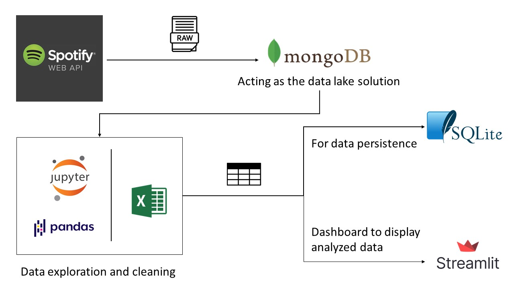

# Spotify-Insights
A data pipeline built using the Spotify API, Python, MongoDB, SQLite and Streamlit.

The pipeline focuses on *ingesting* raw data from Spotify using their API to get the [most recently played songs](https://developer.spotify.com/documentation/web-api/reference/#endpoint-get-recently-played) of the user. MongoDB acts as our data lake where all the raw data
is dumped. Everyday we dump the most recently played songs in a collection named by the day's date. We *extract* only the data we need using tools like *Jupyter Notebook*
and *Pandas* or even *MS Excel* to clean and explore the data as we like. We keep a CSV file where everyday we append clean data to be used for further analysis or presentations.

Then, we *load* and *store* the final clean version of the data in a relational database for persistence, in our case we're using SQLite3. 

Finally a dashboard built using [Streamlit framework](https://streamlit.io/) to show some stats on the data.

## To run the dashboard app

Make sure you have Virtualenv installed to be able to run the app within a virtual environment before you dig in.

`pip install virtualenv`

Create the environment `py -m venv env`

If you're using Windows, activate the environment using `env\Scripts\activate.bat`
Then you'll need to install the used packages using `pip install -r requirements.txt`

At the end, `streamlit run dashboard.py`
